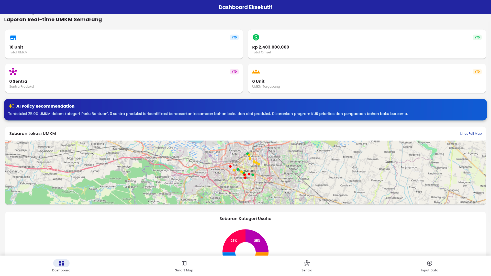
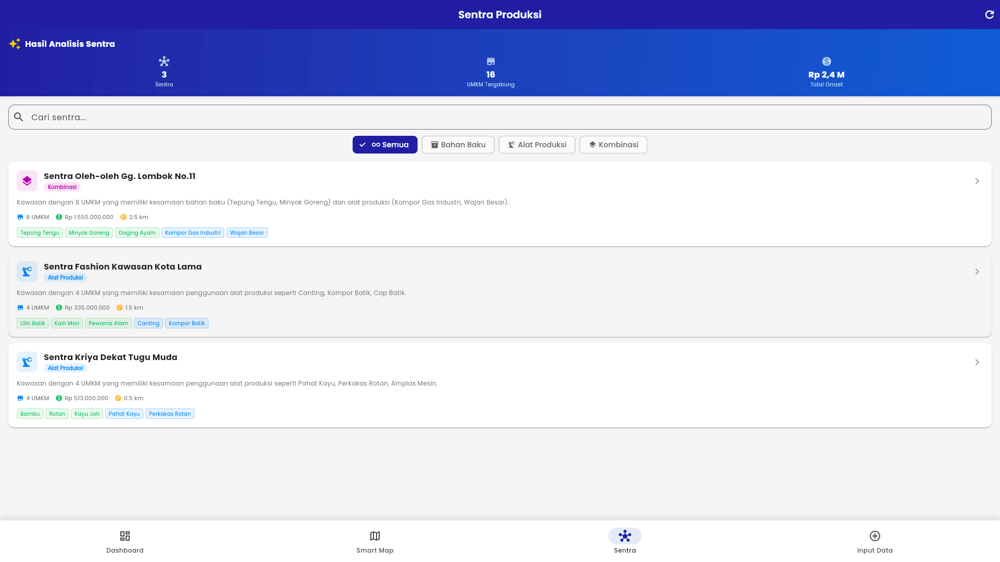
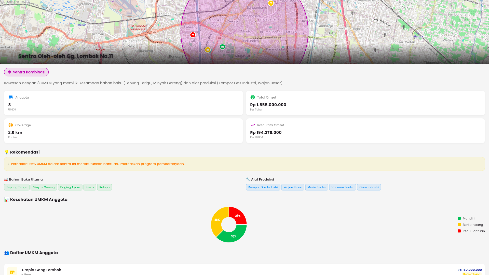
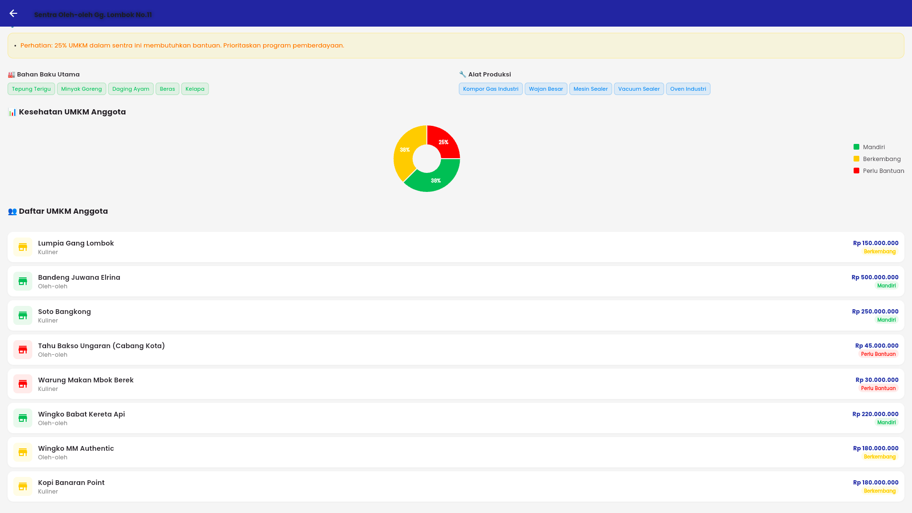
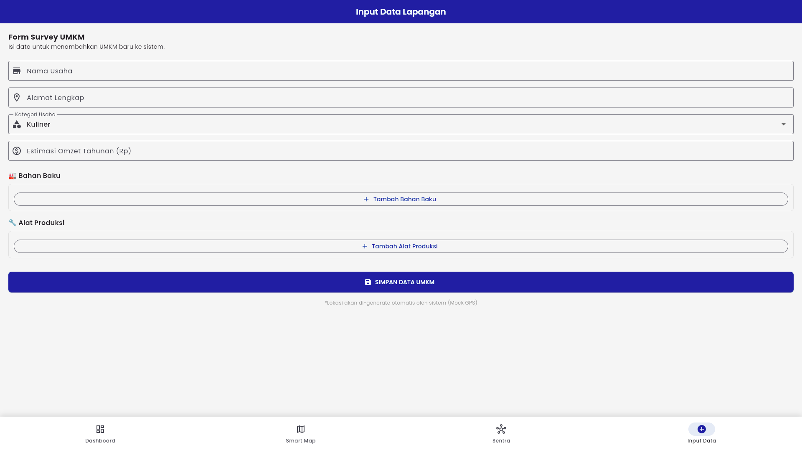

# 🏢 SUSMAS - Semarang UMKM Smart Mapping & Analytics System


> Sistem Pemetaan Cerdas UMKM Kota Semarang dengan Fitur Identifikasi Sentra Produksi

---

## 📋 Deskripsi

SUSMAS adalah aplikasi mobile berbasis Flutter yang menyediakan:

- **Smart Mapping** - Visualisasi geografis seluruh UMKM di Kota Semarang
- **Dashboard Eksekutif** - Statistik real-time untuk pengambilan keputusan  
- **AI-Powered Analytics** - Rekomendasi kebijakan berbasis data
- **Analisis Sentra Produksi** - Identifikasi cluster berdasarkan kesamaan bahan baku dan alat produksi

---

## 🚀 Fitur Utama

### 1. Dashboard Eksekutif
- Ringkasan total UMKM dan omzet
- Grafik sebaran kategori usaha
- AI Policy Recommendation
- Preview peta UMKM

### 2. Smart Map
- Visualisasi marker UMKM dengan warna berdasarkan kesehatan usaha
- Zone overlay sentra produksi
- Detail bottom sheet saat klik marker

### 3. Sentra Produksi *(NEW v2.0)*
- Identifikasi cluster berdasarkan kesamaan bahan baku
- Identifikasi cluster berdasarkan kesamaan alat produksi
- Visualisasi zona sentra di peta
- Rekomendasi pengembangan sentra

### 4. Input Data
- Form pendaftaran UMKM baru
- Input bahan baku (multi-select)
- Input alat produksi (multi-select)

---

## 🛠️ Technology Stack

| Layer | Technology | Version |
|-------|-----------|---------|
| Framework | Flutter | 3.7.x |
| State Management | Provider | 6.x |
| Mapping | flutter_map | 7.x |
| Charts | fl_chart | 0.69.x |
| Typography | google_fonts | 6.x |

---

## 📁 Struktur Proyek

```
lib/
├── main.dart                     # Entry point
├── data/
│   ├── models/                   # Data models
│   │   ├── umkm.dart
│   │   ├── bahan_baku.dart
│   │   ├── alat_produksi.dart
│   │   └── sentra_produksi.dart
│   └── mock/                     # Mock data
│       ├── mock_catalogs.dart
│       └── mock_umkm_data.dart
├── services/
│   └── sentra_identification_service.dart
└── presentation/
    ├── providers/
    │   ├── umkm_provider.dart
    │   └── sentra_provider.dart
    └── pages/
        ├── sentra_list_page.dart
        └── sentra_detail_page.dart
```

---

## 🏃 Cara Menjalankan

```bash
# Clone repository
git clone <repository-url>
cd semarang_umkm_map

# Install dependencies
flutter pub get

# Run (Chrome)
flutter run -d chrome

# Run (Android)
flutter run -d android

# Build Web Release
flutter build web --release
```

---

## 📖 Dokumentasi

| Dokumen | Deskripsi |
|---------|-----------|
| [Project Charter](docs/PROJECT_CHARTER.md) | Dokumen perencanaan proyek |
| [FRS](docs/FRS.md) | Functional Requirements Specification |
| [WBS](docs/WBS.md) | Work Breakdown Structure |
| [Gantt Chart](docs/GANTT_CHART.md) | Timeline proyek |
| [Walkthrough](docs/WALKTHROUGH.md) | Dokumentasi implementasi |

---

## 👥 Tim Pengembang

| Role | Nama | Tanggung Jawab |
|------|------|----------------|
| Project Manager | Dimas Daffa | Koordinasi, Planning, Monitoring |
| Lead Developer | Ahmad Fariz | Arsitektur, Core Development |
| Frontend Developer | Rina Kusuma | UI/UX Implementation |
| Backend Developer | Budi Santoso | Services, Data Layer |
| QA Engineer | Siti Aminah | Testing, Quality Assurance |

---

## 📊 Status Proyek

**Phase 1 (v2.0)**: ✅ Completed
- Data Model Enhancement
- Clustering Algorithm
- Sentra Visualization
- Enhanced Input Form

**Phase 2 (Planned)**:
- Backend API Integration
- Real GPS Location
- Export to PDF

---







## 📄 Lisensi

© 2026 Dinas Koperasi dan UMKM Kota Semarang

---

*Built with ❤️ using Flutter*
