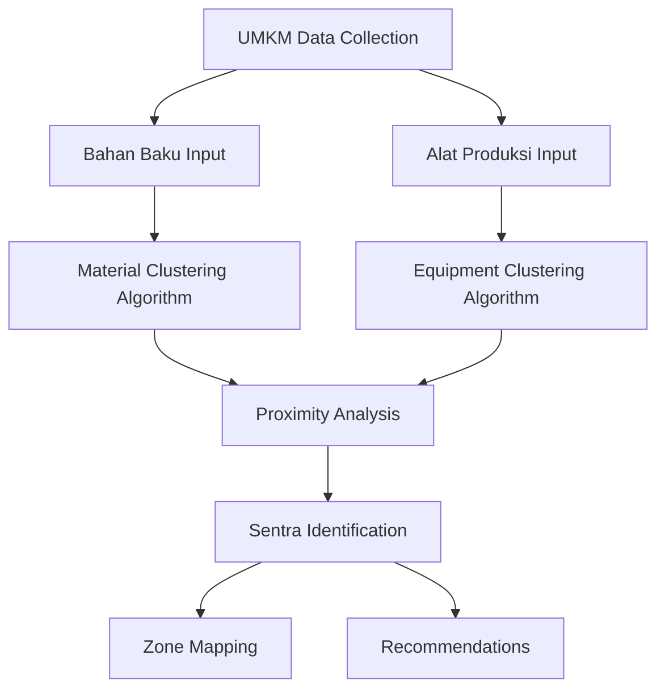

# PROJECT CHARTER
## Sistem Pemetaan Cerdas UMKM Kota Semarang (SUSMAS)
### Semarang UMKM Smart Mapping & Analytics System

---

![Project Banner Concept: Modern digital map of Semarang with UMKM clusters visualization]

---

## 📋 Informasi Dokumen

| **Atribut** | **Detail** |
|-------------|------------|
| **Nama Proyek** | Sistem Pemetaan Cerdas UMKM Kota Semarang (SUSMAS) |
| **Versi Dokumen** | 2.0 |
| **Tanggal Pembuatan** | 5 Januari 2026 |
| **Status** | Draft - Pending Approval |
| **Project Manager** | [Nama PM] |
| **Sponsor** | Dinas Koperasi dan UMKM Kota Semarang |

---

## 1. EXECUTIVE SUMMARY

### 1.1 Latar Belakang

Kota Semarang sebagai ibukota Provinsi Jawa Tengah memiliki potensi ekonomi yang besar dari sektor Usaha Mikro, Kecil, dan Menengah (UMKM). Berdasarkan data Dinas Koperasi dan UMKM, terdapat lebih dari 100.000 UMKM yang tersebar di 16 kecamatan dengan berbagai sektor usaha yang berkontribusi signifikan terhadap Produk Domestik Regional Bruto (PDRB).

Namun, pengelolaan data UMKM yang masih konvensional menyebabkan beberapa permasalahan:
- **Pemetaan tidak optimal** - Persebaran UMKM tidak terdokumentasi dengan baik secara geografis
- **Analisis terbatas** - Sulit mengidentifikasi cluster atau sentra produksi
- **Kebijakan tidak tepat sasaran** - Program bantuan tidak didasarkan pada data yang akurat
- **Potensi rantai pasok** - Belum ada identifikasi kesamaan bahan baku dan alat produksi antar UMKM

### 1.2 Visi Proyek

> *"Mewujudkan Sistem Pemetaan Digital UMKM yang Cerdas, Terintegrasi, dan Berbasis Data untuk Mendukung Pengambilan Keputusan Strategis dan Pengembangan Sentra Produksi di Kota Semarang"*

### 1.3 Ringkasan Solusi

SUSMAS adalah aplikasi mobile berbasis Flutter yang menyediakan:

1. **Smart Mapping** - Visualisasi geografis seluruh UMKM di Kota Semarang
2. **Dashboard Eksekutif** - Statistik real-time untuk pengambilan keputusan
3. **AI-Powered Analytics** - Rekomendasi kebijakan berbasis data
4. **🆕 Analisis Sentra Produksi** - Identifikasi cluster berdasarkan kesamaan **bahan baku** dan **alat produksi**

---

## 2. TUJUAN DAN SASARAN PROYEK

### 2.1 Tujuan Umum (Goal)

Mengembangkan sistem informasi geografis (SIG) berbasis mobile yang mampu memetakan, menganalisis, dan mengidentifikasi potensi pengembangan sentra produksi UMKM di Kota Semarang.

### 2.2 Tujuan Khusus (Objectives)

| **No** | **Tujuan** | **Indikator Keberhasilan** | **Target** |
|--------|------------|---------------------------|-----------|
| 1 | Memetakan seluruh UMKM secara digital | Jumlah UMKM terdaftar di sistem | ≥ 1.000 UMKM (Fase 1) |
| 2 | Mengklasifikasikan kesehatan usaha | Akurasi klasifikasi Mandiri/Berkembang/Perlu Bantuan | ≥ 95% |
| 3 | Mengidentifikasi sentra produksi | Jumlah sentra produksi teridentifikasi | ≥ 10 sentra |
| 4 | Menyediakan rekomendasi berbasis AI | Jumlah rekomendasi yang diterima pengguna | ≥ 80% relevansi |
| 5 | Memfasilitasi pengambilan keputusan | Waktu yang dibutuhkan untuk analisis data | ↓ 70% dari proses manual |

### 2.3 SMART Objectives

```
S - Specific    : Sistem pemetaan UMKM dengan analisis sentra produksi
M - Measurable  : Target 1.000+ UMKM terpetakan dengan 10+ sentra teridentifikasi
A - Achievable  : Menggunakan teknologi proven (Flutter + OpenStreetMap)
R - Relevant    : Mendukung program digitalisasi UMKM Kota Semarang
T - Time-bound  : Implementasi dalam 6 bulan (Phase 1)
```

---

## 3. RUANG LINGKUP PROYEK (SCOPE)

### 3.1 In-Scope (Termasuk)

#### A. Fitur Existing (Sudah Diimplementasikan)

| **Modul** | **Fitur** | **Status** |
|-----------|-----------|------------|
| Dashboard Eksekutif | Ringkasan total UMKM dan omzet | ✅ Selesai |
| Dashboard Eksekutif | Grafik sebaran kategori usaha (Pie Chart) | ✅ Selesai |
| Dashboard Eksekutif | AI Policy Recommendation | ✅ Selesai |
| Dashboard Eksekutif | Preview peta UMKM | ✅ Selesai |
| Smart Map | Visualisasi marker UMKM di peta | ✅ Selesai |
| Smart Map | Klasifikasi warna berdasarkan kesehatan usaha | ✅ Selesai |
| Smart Map | Detail bottom sheet saat klik marker | ✅ Selesai |
| Input Data | Form pendaftaran UMKM baru | ✅ Selesai |
| Input Data | Auto-generate lokasi (simulasi GPS) | ✅ Selesai |

#### B. Fitur Baru - Analisis Sentra Produksi (NEW)

| **Modul** | **Fitur** | **Prioritas** |
|-----------|-----------|---------------|
| Data Model | Penambahan atribut bahan baku dan alat produksi | 🔴 High |
| Input Data | Form input bahan baku UMKM | 🔴 High |
| Input Data | Form input alat produksi UMKM | 🔴 High |
| Analisis | Algoritma clustering berdasarkan kesamaan material | 🔴 High |
| Analisis | Algoritma clustering berdasarkan kesamaan alat | 🔴 High |
| Visualisasi | Halaman daftar sentra produksi yang teridentifikasi | 🔴 High |
| Visualisasi | Peta overlay zona sentra produksi | 🟡 Medium |
| Visualisasi | Detail sentra dengan daftar UMKM anggota | 🔴 High |
| Dashboard | Widget ringkasan sentra produksi | 🟡 Medium |
| Export | Laporan sentra produksi dalam format PDF | 🟢 Low |

### 3.2 Out-of-Scope (Tidak Termasuk)

| **Item** | **Alasan** |
|----------|-----------|
| Integrasi dengan sistem OSS (Online Single Submission) | Memerlukan koordinasi dengan pemerintah pusat |
| E-commerce marketplace | Di luar fokus pemetaan |
| Sistem keuangan/pembukuan UMKM | Scope terpisah |
| Integrasi dengan perbankan | Memerlukan kerjasama pihak ketiga |
| Backend server untuk produksi | Fase 1 menggunakan data lokal/hardcoded |

### 3.3 Batasan (Constraints)

1. **Teknologi**: Pengembangan menggunakan Flutter (cross-platform)
2. **Data**: Fase awal menggunakan data dummy, integrasi API di Fase 2
3. **Geografis**: Fokus pada wilayah Kota Semarang (16 Kecamatan)
4. **Waktu**: Pengembangan Fase 1 maksimal 6 bulan
5. **Budget**: Sesuai dengan anggaran yang disetujui

---

## 4. FITUR UTAMA: IDENTIFIKASI SENTRA PRODUKSI

### 4.1 Konsep Sentra Produksi



**Sentra Produksi** adalah kawasan geografis yang memiliki konsentrasi tinggi UMKM dengan karakteristik produksi yang serupa, ditentukan berdasarkan:

1. **Kesamaan Bahan Baku** - UMKM yang menggunakan bahan baku sejenis
2. **Kesamaan Alat Produksi** - UMKM yang menggunakan peralatan produksi serupa
3. **Kedekatan Geografis** - UMKM yang berada dalam radius tertentu

### 4.2 Data Model Enhancement

#### Current Model (Existing)

```dart
class Umkm {
  final String id;
  final String nama;
  final String kategori;
  final double omzet;
  final LatLng lokasi;
  final String alamat;
}
```

#### Enhanced Model (Proposed)

```dart
class Umkm {
  final String id;
  final String nama;
  final String kategori;
  final double omzet;
  final LatLng lokasi;
  final String alamat;
  
  // NEW: Production Analysis Fields
  final List<BahanBaku> bahanBakuList;       // Daftar bahan baku
  final List<AlatProduksi> alatProduksiList; // Daftar alat produksi
  final String? sentraId;                     // Sentra yang terafiliasi
}

class BahanBaku {
  final String id;
  final String nama;
  final String kategori;  // 'Pertanian', 'Peternakan', 'Mineral', 'Sintetis', etc.
  final String satuan;
  final double estimasiPenggunaan; // per bulan
  final String? sumberLokal;       // Daerah asal bahan
}

class AlatProduksi {
  final String id;
  final String nama;
  final String jenisAlat;    // 'Manual', 'Semi-Otomatis', 'Otomatis'
  final String kategori;     // 'Pengolahan', 'Pengemasan', 'Transportasi', etc.
  final int jumlahUnit;
  final String? merek;
}

class SentraProduksi {
  final String id;
  final String nama;
  final String deskripsi;
  final LatLng pusatLokasi;
  final double radiusCoverage;  // dalam km
  final List<String> umkmIds;   // UMKM yang tergabung
  final List<String> bahanBakuUtama;
  final List<String> alatProduksiUtama;
  final String tipeSentra;      // 'Bahan Baku', 'Alat Produksi', 'Kombinasi'
  final int jumlahAnggota;
  final double totalOmzet;
}
```

### 4.3 Algoritma Identifikasi Sentra

#### Phase 1: Material-Based Clustering

```dart
/// Clustering berdasarkan kesamaan bahan baku
class MaterialClusteringService {
  
  /// Menghitung similarity score antara dua UMKM berdasarkan bahan baku
  double calculateMaterialSimilarity(Umkm a, Umkm b) {
    final materialsA = a.bahanBakuList.map((e) => e.kategori).toSet();
    final materialsB = b.bahanBakuList.map((e) => e.kategori).toSet();
    
    // Jaccard Similarity Index
    final intersection = materialsA.intersection(materialsB).length;
    final union = materialsA.union(materialsB).length;
    
    return union > 0 ? intersection / union : 0.0;
  }
  
  /// Mengidentifikasi cluster berdasarkan threshold similarity
  List<SentraProduksi> identifyClusters({
    required List<Umkm> umkmList,
    double similarityThreshold = 0.6,
    double maxDistance = 5.0, // km
  }) {
    // Implementation: DBSCAN or K-Means variant
  }
}
```

#### Phase 2: Equipment-Based Clustering

```dart
/// Clustering berdasarkan kesamaan alat produksi
class EquipmentClusteringService {
  
  double calculateEquipmentSimilarity(Umkm a, Umkm b) {
    final equipmentA = a.alatProduksiList.map((e) => e.kategori).toSet();
    final equipmentB = b.alatProduksiList.map((e) => e.kategori).toSet();
    
    // Jaccard Similarity Index
    final intersection = equipmentA.intersection(equipmentB).length;
    final union = equipmentA.union(equipmentB).length;
    
    return union > 0 ? intersection / union : 0.0;
  }
}
```

### 4.4 Contoh Use Case

#### Skenario: Identifikasi Sentra Batik

| **UMKM** | **Bahan Baku** | **Alat Produksi** | **Lokasi** |
|----------|----------------|-------------------|-----------|
| Batik Semarang Indah | Kain Mori, Lilin, Pewarna Alam | Canting, Kompor, Wajan | Kota Lama |
| Batik Lawang Sewu | Kain Primisima, Lilin, Pewarna Sintetis | Canting, Cap Batik, Kompor | Tugu Muda |
| Batik Sanggar Puri | Kain Mori, Lilin, Pewarna Alam | Canting, Kompor, Gawangan | Pedurungan |

**Hasil Analisis:**
- **Material Similarity**: High (Kain, Lilin, Pewarna)
- **Equipment Similarity**: High (Canting, Kompor)
- **Proximity**: Medium (3-5 km range)
- **Rekomendasi**: ✅ **Potensi Sentra Batik Semarang**

### 4.5 UI/UX Design Concept

#### Halaman Sentra Produksi (New Page)

```
┌────────────────────────────────────────┐
│  ← Sentra Produksi                     │
├────────────────────────────────────────┤
│                                        │
│  🔍 Cari sentra...                     │
│                                        │
│  📊 Filter:                            │
│  [Bahan Baku ▼] [Alat Produksi ▼]     │
│                                        │
├────────────────────────────────────────┤
│  ┌──────────────────────────────────┐  │
│  │ 🏭 Sentra Batik Semarang         │  │
│  │ 📍 Kawasan Kota Lama - Tugu Muda │  │
│  │ 👥 12 UMKM Anggota               │  │
│  │ 💰 Rp 2.5M Total Omzet           │  │
│  │                                  │  │
│  │ Bahan Utama: Kain, Lilin, Pewarna│  │
│  │ Alat Utama: Canting, Kompor      │  │
│  │                        [Detail →]│  │
│  └──────────────────────────────────┘  │
│                                        │
│  ┌──────────────────────────────────┐  │
│  │ 🏭 Sentra Kuliner Olahan         │  │
│  │ 📍 Kawasan Simpang Lima          │  │
│  │ 👥 25 UMKM Anggota               │  │
│  │ 💰 Rp 5.8M Total Omzet           │  │
│  │                                  │  │
│  │ Bahan Utama: Tepung, Gula, Minyak│  │
│  │ Alat Utama: Oven, Mixer, Wajan   │  │
│  │                        [Detail →]│  │
│  └──────────────────────────────────┘  │
│                                        │
└────────────────────────────────────────┘
```

#### Overlay Peta Sentra

```
┌────────────────────────────────────────┐
│  Peta Sentra Produksi                  │
├────────────────────────────────────────┤
│                                        │
│    ╭─────────╮      ╭───────╮         │
│   ╱  Sentra   ╲    ╱ Sentra  ╲        │
│  │   Batik    │   │  Kuliner │         │
│   ╲  (12 UMKM)╱    ╲ (25 UMKM)╱        │
│    ╰─────────╯      ╰───────╯         │
│                                        │
│         📍 📍 📍                        │
│           ╭────────╮                   │
│          ╱  Sentra  ╲                  │
│         │   Kriya   │                  │
│          ╲ (8 UMKM) ╱                  │
│           ╰────────╯                   │
│                                        │
├────────────────────────────────────────┤
│ Legend:                                │
│ ⚫ Bahan Baku  🔵 Alat Produksi  🟢 Kombinasi │
└────────────────────────────────────────┘
```

---

## 5. STAKEHOLDER ANALYSIS

### 5.1 Stakeholder Register

| **Stakeholder** | **Kategori** | **Interest** | **Influence** | **Strategi Engagement** |
|-----------------|--------------|--------------|---------------|------------------------|
| Dinas Koperasi UMKM Semarang | Primary | High | High | Kolaborasi intensif, laporan berkala |
| Walikota Semarang | Executive Sponsor | High | Very High | Presentasi eksekutif, demo |
| Pelaku UMKM | End User | High | Medium | Focus group, UAT, training |
| Tim Developer | Internal | Medium | High | Daily standup, sprint review |
| Asosiasi UMKM | Secondary | Medium | Medium | Workshop, sosialisasi |
| Perbankan/Lembaga Keuangan | External | Medium | Low | Information sharing |
| Akademisi/Peneliti | External | Medium | Low | Akses data untuk riset |

### 5.2 RACI Matrix

| **Aktivitas** | **Tim Dev** | **PM** | **Dinas KUMKM** | **UMKM** | **Sponsor** |
|---------------|-------------|--------|-----------------|----------|-------------|
| Pengembangan Aplikasi | R | A | C | I | I |
| Pengumpulan Data UMKM | C | A | R | R | I |
| Validasi Algoritma Sentra | R | R | A | C | I |
| Testing & UAT | R | A | C | R | I |
| Deployment | R | A | I | I | C |
| Training Pengguna | C | A | R | R | I |
| Monitoring & Evaluasi | R | R | A | C | I |

*R = Responsible, A = Accountable, C = Consulted, I = Informed*

---

## 6. WORK BREAKDOWN STRUCTURE (WBS)

### 6.1 WBS Diagram

```
SUSMAS v2.0
│
├── 1. PROJECT MANAGEMENT
│   ├── 1.1 Initiating
│   │   ├── 1.1.1 Project Charter
│   │   └── 1.1.2 Stakeholder Identification
│   ├── 1.2 Planning
│   │   ├── 1.2.1 Requirements Gathering
│   │   ├── 1.2.2 Technical Design
│   │   └── 1.2.3 Sprint Planning
│   ├── 1.3 Monitoring & Control
│   │   ├── 1.3.1 Progress Tracking
│   │   └── 1.3.2 Quality Assurance
│   └── 1.4 Closing
│       ├── 1.4.1 Documentation
│       └── 1.4.2 Handover
│
├── 2. DATA MODEL ENHANCEMENT
│   ├── 2.1 Design Domain Model
│   │   ├── 2.1.1 BahanBaku Entity
│   │   ├── 2.1.2 AlatProduksi Entity
│   │   └── 2.1.3 SentraProduksi Entity
│   ├── 2.2 Update UMKM Model
│   │   └── 2.2.1 Add production fields
│   └── 2.3 Dummy Data Generation
│       ├── 2.3.1 Material catalog
│       └── 2.3.2 Equipment catalog
│
├── 3. INPUT MODULE ENHANCEMENT
│   ├── 3.1 Material Input Form
│   │   ├── 3.1.1 UI Design
│   │   ├── 3.1.2 Validation Logic
│   │   └── 3.1.3 Multi-select Component
│   ├── 3.2 Equipment Input Form
│   │   ├── 3.2.1 UI Design
│   │   ├── 3.2.2 Validation Logic
│   │   └── 3.2.3 Multi-select Component
│   └── 3.3 Form Integration
│       └── 3.3.1 Update InputDataPage
│
├── 4. ANALYTICS ENGINE
│   ├── 4.1 Clustering Algorithm
│   │   ├── 4.1.1 Material Similarity
│   │   ├── 4.1.2 Equipment Similarity
│   │   └── 4.1.3 Proximity Analysis
│   ├── 4.2 Sentra Identification
│   │   ├── 4.2.1 Cluster Formation
│   │   └── 4.2.2 Sentra Metadata
│   └── 4.3 Recommendation Engine
│       └── 4.3.1 Policy Suggestions
│
├── 5. VISUALIZATION MODULE
│   ├── 5.1 Sentra List Page
│   │   ├── 5.1.1 List View UI
│   │   ├── 5.1.2 Filter/Search
│   │   └── 5.1.3 Card Component
│   ├── 5.2 Sentra Detail Page
│   │   ├── 5.2.1 Info Section
│   │   ├── 5.2.2 Member UMKM List
│   │   └── 5.2.3 Material/Equipment Charts
│   ├── 5.3 Map Overlay
│   │   ├── 5.3.1 Zone Polygons
│   │   └── 5.3.2 Legend Update
│   └── 5.4 Dashboard Enhancement
│       └── 5.4.1 Sentra Summary Widget
│
├── 6. INTEGRATION & TESTING
│   ├── 6.1 Unit Testing
│   ├── 6.2 Integration Testing
│   ├── 6.3 UAT
│   └── 6.4 Performance Testing
│
└── 7. DEPLOYMENT
    ├── 7.1 Build Release
    ├── 7.2 Documentation
    └── 7.3 User Training
```

### 6.2 Deliverables

| **WBS** | **Deliverable** | **Deskripsi** |
|---------|-----------------|---------------|
| 1.1.1 | Project Charter | Dokumen ini |
| 2.1 | Domain Model Document | Spesifikasi entity baru |
| 3.3.1 | Enhanced Input Form | Form dengan input bahan dan alat |
| 4.2.2 | Clustering Service | Algoritma identifikasi sentra |
| 5.1 | Sentra List Page | Halaman daftar sentra |
| 5.2 | Sentra Detail Page | Halaman detail sentra |
| 5.3 | Zone Overlay | Visualisasi zona di peta |
| 6.3 | UAT Report | Hasil pengujian pengguna |
| 7.2 | User Manual | Panduan penggunaan |

---

## 7. JADWAL PROYEK (TIMELINE)

### 7.1 Gantt Chart Overview

```
                    MINGGU
    1   2   3   4   5   6   7   8   9   10  11  12
    ├───┼───┼───┼───┼───┼───┼───┼───┼───┼───┼───┼───┤
PM  ████████████████████████████████████████████████
    
DM  ████████░░░░░░░░░░░░░░░░░░░░░░░░░░░░░░░░░░░░░░░░
    
INPUT   ░░░░████████████░░░░░░░░░░░░░░░░░░░░░░░░░░░░
    
ANALYTICS   ░░░░░░░░████████████████░░░░░░░░░░░░░░░░
    
VISUAL      ░░░░░░░░░░░░░░░░████████████████░░░░░░░░
    
TESTING         ░░░░░░░░░░░░░░░░░░░░░░░░████████████
    
DEPLOY              ░░░░░░░░░░░░░░░░░░░░░░░░░░░░████

Legend: ████ Active  ░░░░ Idle
```

### 7.2 Sprint Schedule (3 Months / 6 Sprints)

| **Sprint** | **Durasi** | **Fokus** | **Deliverables** |
|------------|-----------|-----------|-----------------|
| Sprint 1 | Minggu 1-2 | Data Model Enhancement | Entity classes, mock data |
| Sprint 2 | Minggu 3-4 | Input Module | Material & Equipment forms |
| Sprint 3 | Minggu 5-6 | Analytics Engine | Clustering algorithm |
| Sprint 4 | Minggu 7-8 | Visualization (Part 1) | Sentra List & Detail |
| Sprint 5 | Minggu 9-10 | Visualization (Part 2) | Map overlay, Dashboard |
| Sprint 6 | Minggu 11-12 | Testing & Deployment | UAT, Bug fixes, Release |

### 7.3 Milestones

| **Milestone** | **Target Date** | **Kriteria Sukses** |
|---------------|-----------------|---------------------|
| M1: Data Model Complete | Minggu 2 | Entity classes reviewed & approved |
| M2: Input Form Ready | Minggu 4 | Form dapat menyimpan bahan & alat |
| M3: Algorithm Working | Minggu 6 | Clustering menghasilkan sentra valid |
| M4: UI Complete | Minggu 10 | Semua halaman baru berfungsi |
| M5: Go-Live | Minggu 12 | Aplikasi siap produksi |

---

## 8. NILAI PROYEK DAN ANGGARAN

### 8.1 Ringkasan Nilai Proyek

| **Aspek** | **Detail** |
|-----------|------------|
| **Nilai Kontrak Proyek** | **Rp 400.000.000** (Empat Ratus Juta Rupiah) |
| **Durasi Proyek** | 12 Minggu (3 Bulan) |
| **Jumlah Tim** | 5 Orang |
| **Model Pembayaran** | Termin 3x (30% - 40% - 30%) |

### 8.2 Termin Pembayaran

| **Termin** | **Milestone** | **Persentase** | **Nominal** | **Target** |
|------------|---------------|----------------|-------------|------------|
| Termin 1 | Kick-off & Planning Complete | 30% | Rp 120.000.000 | Minggu 2 |
| Termin 2 | Development Complete (UAT Ready) | 40% | Rp 160.000.000 | Minggu 10 |
| Termin 3 | Go-Live & Handover | 30% | Rp 120.000.000 | Minggu 12 |
| **TOTAL** | | **100%** | **Rp 400.000.000** | |

---

### 8.3 Cost Breakdown Structure

| **Kategori** | **Item** | **Satuan** | **Vol** | **Harga** | **Total** |
|--------------|----------|-----------|---------|-----------|-----------|
| **SDM** | | | | | |
| | Lead Developer (Ahmad Fariz) | Man-month | 3 | Rp 25.000.000 | Rp 75.000.000 |
| | Backend Developer (Budi Santoso) | Man-month | 3 | Rp 18.000.000 | Rp 54.000.000 |
| | Frontend Developer (Rina Kusuma) | Man-month | 3 | Rp 18.000.000 | Rp 54.000.000 |
| | Project Manager (Dimas Daffa) | Man-month | 3 | Rp 20.000.000 | Rp 60.000.000 |
| | QA Engineer (Siti Aminah) | Man-month | 3 | Rp 15.000.000 | Rp 45.000.000 |
| **Subtotal SDM** | | | | | **Rp 288.000.000** |
| **Infrastruktur** | | | | | |
| | Development Devices | Unit | 3 | Rp 5.000.000 | Rp 15.000.000 |
| | Map API (if needed) | Subscription | 6 | Rp 1.500.000 | Rp 9.000.000 |
| | Testing Devices | Unit | 5 | Rp 3.000.000 | Rp 15.000.000 |
| **Subtotal Infrastruktur** | | | | | **Rp 39.000.000** |
| **Operasional** | | | | | |
| | Survey Lapangan | Kegiatan | 3 | Rp 5.000.000 | Rp 15.000.000 |
| | Focus Group Discussion | Kegiatan | 2 | Rp 3.000.000 | Rp 6.000.000 |
| | Training Pengguna | Kegiatan | 2 | Rp 4.000.000 | Rp 8.000.000 |
| **Subtotal Operasional** | | | | | **Rp 29.000.000** |
| | | | | | |
| **TOTAL BIAYA** | | | | | **Rp 356.000.000** |

---

### 8.4 Distribusi Keuntungan Tim

| **No** | **Nama** | **Role** | **Gaji (3 bln)** | **Profit Share** | **Total Pendapatan** |
|--------|----------|----------|------------------|------------------|----------------------|
| 1 | **Dimas Daffa** | Project Manager | Rp 60.000.000 | Rp 12.000.000 (27%) | **Rp 72.000.000** |
| 2 | **Ahmad Fariz** | Lead Developer | Rp 75.000.000 | Rp 11.000.000 (25%) | **Rp 86.000.000** |
| 3 | **Rina Kusuma** | Frontend Developer | Rp 54.000.000 | Rp 8.800.000 (20%) | **Rp 62.800.000** |
| 4 | **Budi Santoso** | Backend Developer | Rp 54.000.000 | Rp 8.000.000 (18%) | **Rp 62.000.000** |
| 5 | **Siti Aminah** | QA Engineer | Rp 45.000.000 | Rp 4.400.000 (10%) | **Rp 49.400.000** |
| | **TOTAL** | | **Rp 288.000.000** | **Rp 44.200.000** | **Rp 332.200.000** |

### 8.5 Perhitungan Profit

```
Nilai Kontrak              : Rp 400.000.000
─────────────────────────────────────────
(-) Biaya SDM              : Rp 288.000.000
(-) Biaya Infrastruktur    : Rp  39.000.000
(-) Biaya Operasional      : Rp  29.000.000
─────────────────────────────────────────
= GROSS PROFIT             : Rp  44.000.000
─────────────────────────────────────────
Profit Margin              : 11%
```

### 8.6 Profit Sharing Mechanism

| **Level** | **Persentase dari Profit** | **Basis** |
|-----------|---------------------------|-----------|
| Project Manager | 27% | Tanggung jawab keseluruhan, koordinasi |
| Lead Developer | 25% | Technical leadership, code review |
| Frontend Developer | 20% | UI/UX implementation volume |
| Backend Developer | 18% | Services & algorithm complexity |
| QA Engineer | 10% | Testing & documentation |
| **TOTAL** | **100%** | |

> [!IMPORTANT]
> Profit sharing didistribusikan setelah pembayaran **Termin 3** diterima dari klien dan seluruh kewajiban proyek telah diselesaikan.

### 8.7 Ringkasan Pendapatan Per Anggota

```
┌─────────────────────────────────────────────────────────────────────┐
│                    PENDAPATAN TIM SUSMAS v2.0                        │
├─────────────────────────────────────────────────────────────────────┤
│                                                                      │
│  Dimas Daffa (PM)         ████████████████████████████  Rp 72.0 Jt  │
│  Ahmad Fariz (Lead)       ██████████████████████████████ Rp 86.0 Jt │
│  Rina Kusuma (Frontend)   ██████████████████████        Rp 62.8 Jt  │
│  Budi Santoso (Backend)   █████████████████████         Rp 62.0 Jt  │
│  Siti Aminah (QA)         █████████████████             Rp 49.4 Jt  │
│                                                                      │
│  ─────────────────────────────────────────────────────────────────  │
│  TOTAL NILAI KONTRAK:              Rp 400.000.000                   │
│  TOTAL PENDAPATAN TIM:             Rp 332.200.000                   │
│  SISA (Infrastruktur + Ops):       Rp  67.800.000                   │
└─────────────────────────────────────────────────────────────────────┘
```

> [!NOTE]
> - Nilai di atas adalah estimasi berdasarkan asumsi tidak ada scope creep
> - Overtime atau penambahan fitur akan dikenakan biaya tambahan
> - Pajak (PPh 21) ditanggung masing-masing individu

---

## 9. MANAJEMEN RISIKO

### 9.1 Risk Register

| **ID** | **Risiko** | **Probabilitas** | **Dampak** | **Skor** | **Mitigasi** |
|--------|-----------|------------------|-----------|----------|--------------|
| R01 | Data UMKM tidak lengkap/akurat | Medium | High | 🔴 High | Validasi data melalui survey lapangan |
| R02 | Algoritma clustering tidak akurat | Medium | High | 🔴 High | Iterative testing dengan data real |
| R03 | Resistensi pengguna terhadap sistem | Medium | Medium | 🟡 Medium | Sosialisasi dan training intensif |
| R04 | Keterlambatan pengembangan | Medium | Medium | 🟡 Medium | Buffer time di setiap sprint |
| R05 | Perubahan requirement dari stakeholder | High | Medium | 🟡 Medium | Dokumentasi yang jelas, change control |
| R06 | Performa aplikasi lambat | Low | High | 🟡 Medium | Optimization dan lazy loading |
| R07 | Masalah kompatibilitas device | Low | Medium | 🟢 Low | Testing multi-device |
| R08 | Kehilangan key developer | Low | High | 🟡 Medium | Dokumentasi code dan knowledge sharing |

### 9.2 Risk Matrix

```
           │  Low    Medium   High
─────────────────────────────────────
 High Prob │  R05    
           │
 Med Prob  │  R07    R03,R04  R01,R02
           │
 Low Prob  │         R08      R06
```

### 9.3 Contingency Plan

| **Trigger** | **Action** |
|-------------|-----------|
| Data UMKM < 500 entries | Perpanjang periode survey, partnership dengan kecamatan |
| Clustering accuracy < 70% | Hire data scientist consultant untuk tuning |
| Sprint delay > 1 week | Re-prioritize backlog, overtime, atau scope adjustment |
| User adoption < 50% | Intensifkan training, simplify UI, gamification |

---

## 10. QUALITY MANAGEMENT

### 10.1 Quality Standards

| **Aspek** | **Standard** | **Metrik** |
|-----------|-------------|-----------|
| Code Quality | Clean Architecture, SOLID | Maintainability Index > 70 |
| UI/UX | Material Design 3 | User Satisfaction Score ≥ 4.0/5.0 |
| Performance | 60 FPS, < 2s load | Lighthouse score ≥ 80 |
| Accuracy | Clustering validation | Silhouette Score ≥ 0.5 |
| Test Coverage | Unit + Integration | ≥ 80% coverage |

### 10.2 Acceptance Criteria

#### Fitur Identifikasi Sentra Produksi

| **Kriteria** | **Kondisi** |
|--------------|-------------|
| AC-01 | UMKM dapat menginput minimal 5 jenis bahan baku |
| AC-02 | UMKM dapat menginput minimal 5 jenis alat produksi |
| AC-03 | Sistem dapat mengidentifikasi sentra dengan ≥ 3 UMKM serupa |
| AC-04 | Visualisasi sentra tampil di peta dengan polygon yang jelas |
| AC-05 | Detail sentra menampilkan daftar UMKM anggota |
| AC-06 | Dashboard menampilkan widget ringkasan sentra |
| AC-07 | Tidak ada bug critical saat UAT |

---

## 11. COMMUNICATION PLAN

### 11.1 Communication Matrix

| **Stakeholder** | **Informasi** | **Frekuensi** | **Media** | **PIC** |
|-----------------|---------------|---------------|-----------|---------|
| Executive Sponsor | Project Status Summary | Monthly | Presentation | PM |
| Dinas KUMKM | Progress Report | Bi-weekly | Email + Meeting | PM |
| Development Team | Task Updates | Daily | Standup (15 min) | Tech Lead |
| All Stakeholders | Release Notes | Per Sprint | Email + Document | PM |
| UMKM (End Users) | Training Schedule | As needed | WhatsApp Group | PM |

### 11.2 Meeting Schedule

| **Meeting** | **Peserta** | **Jadwal** | **Durasi** |
|-------------|-------------|-----------|-----------|
| Daily Standup | Dev Team | Setiap hari 09:00 | 15 menit |
| Sprint Planning | Tim Inti | Awal sprint | 2 jam |
| Sprint Review | Tim + Dinas | Akhir sprint | 1 jam |
| Retrospective | Dev Team | Akhir sprint | 1 jam |
| Steering Committee | Sponsor + PM | Bulanan | 1 jam |

---

## 12. TECHNICAL SPECIFICATIONS

### 12.1 Technology Stack

| **Layer** | **Technology** | **Version** | **Justification** |
|-----------|---------------|-------------|-------------------|
| Framework | Flutter | 3.7.x | Cross-platform, performance |
| State Management | Provider | 6.x | Simplicity, official support |
| Mapping | flutter_map | 7.x | Open source, OSM integration |
| Charts | fl_chart | 0.69.x | Beautiful, customizable |
| Typography | google_fonts | 6.x | Modern fonts |
| Localization | intl | 0.19.x | Indonesia formatting |

### 12.2 Architecture

```
┌─────────────────────────────────────────────────────────────┐
│                     PRESENTATION LAYER                       │
│  ┌──────────┐ ┌──────────┐ ┌──────────┐ ┌──────────────────┐│
│  │Dashboard │ │Smart Map │ │Input Form│ │Sentra Production ││
│  └──────────┘ └──────────┘ └──────────┘ └──────────────────┘│
└─────────────────────────────────────────────────────────────┘
                              │
                              ▼
┌─────────────────────────────────────────────────────────────┐
│                      BUSINESS LOGIC LAYER                    │
│  ┌────────────────┐  ┌───────────────────────────────────┐  │
│  │ UmkmProvider   │  │ SentraAnalysisService             │  │
│  │ - UMKM CRUD    │  │ - Material Clustering             │  │
│  │ - Statistics   │  │ - Equipment Clustering            │  │
│  │                │  │ - Sentra Identification           │  │
│  └────────────────┘  └───────────────────────────────────┘  │
└─────────────────────────────────────────────────────────────┘
                              │
                              ▼
┌─────────────────────────────────────────────────────────────┐
│                       DATA LAYER                             │
│  ┌──────────┐ ┌──────────┐ ┌────────────┐ ┌───────────────┐ │
│  │   Umkm   │ │BahanBaku │ │AlatProduksi│ │SentraProduksi │ │
│  └──────────┘ └──────────┘ └────────────┘ └───────────────┘ │
│                                                              │
│  [Phase 1: In-Memory/Hardcoded]                             │
│  [Phase 2: Local SQLite/Hive]                               │
│  [Phase 3: REST API Integration]                            │
└─────────────────────────────────────────────────────────────┘
```

### 12.3 File Structure (Proposed)

```
lib/
├── main.dart
├── core/
│   ├── theme/
│   │   └── app_theme.dart
│   ├── constants/
│   │   └── app_constants.dart
│   └── utils/
│       └── geo_utils.dart
├── data/
│   ├── models/
│   │   ├── umkm.dart
│   │   ├── bahan_baku.dart
│   │   ├── alat_produksi.dart
│   │   └── sentra_produksi.dart
│   ├── repositories/
│   │   ├── umkm_repository.dart
│   │   └── sentra_repository.dart
│   └── mock/
│       ├── mock_umkm_data.dart
│       ├── mock_material_catalog.dart
│       └── mock_equipment_catalog.dart
├── services/
│   ├── clustering/
│   │   ├── material_clustering_service.dart
│   │   ├── equipment_clustering_service.dart
│   │   └── sentra_identification_service.dart
│   └── analytics/
│       └── recommendation_service.dart
├── presentation/
│   ├── providers/
│   │   ├── umkm_provider.dart
│   │   └── sentra_provider.dart
│   ├── pages/
│   │   ├── dashboard_page.dart
│   │   ├── smart_map_page.dart
│   │   ├── input_data_page.dart
│   │   ├── sentra_list_page.dart
│   │   └── sentra_detail_page.dart
│   └── widgets/
│       ├── umkm_card.dart
│       ├── sentra_card.dart
│       ├── material_input_widget.dart
│       ├── equipment_input_widget.dart
│       └── zone_overlay.dart
└── test/
    ├── unit/
    │   ├── clustering_test.dart
    │   └── repository_test.dart
    └── widget/
        └── pages_test.dart
```

---

## 13. APPROVAL & SIGN-OFF

### 13.1 Document Approval

| **Role** | **Nama** | **Tanda Tangan** | **Tanggal** |
|----------|----------|------------------|-------------|
| Project Sponsor | | | |
| Project Manager | | | |
| Technical Lead | | | |
| Dinas KUMKM Representative | | | |

### 13.2 Change Control

Setiap perubahan terhadap Project Charter ini harus melalui proses:
1. Pengajuan Change Request Form
2. Impact Analysis oleh PM
3. Review oleh Steering Committee
4. Approval oleh Sponsor
5. Update Dokumentasi

---

## 14. APPENDIX

### A. Katalog Bahan Baku (Sample)

| **Kategori** | **Contoh Bahan** |
|--------------|------------------|
| Pertanian | Tepung terigu, Gula, Beras, Jagung, Kelapa |
| Peternakan | Daging, Susu, Telur, Kulit hewan |
| Perikanan | Ikan, Udang, Rumput laut, Garam |
| Tekstil | Kain mori, Benang, Katun, Sutra |
| Mineral | Tanah liat, Pasir, Batu |
| Sintetis | Pewarna buatan, Plastik, Resin |
| Kayu | Kayu jati, Rotan, Bambu |

### B. Katalog Alat Produksi (Sample)

| **Kategori** | **Contoh Alat** |
|--------------|-----------------|
| Pengolahan | Mesin giling, Mixer, Oven, Kompor industri |
| Pengemasan | Sealer, Vacuum pack, Labeling machine |
| Tekstil | Canting, Cap batik, Mesin jahit, Loom |
| Kriya | Pahat, Gergaji, Bubut kayu |
| Transportasi | Gerobak, Etalase |

### C. Referensi

1. Peraturan Daerah Kota Semarang tentang Pemberdayaan UMKM
2. Rencana Strategis Dinas Koperasi dan UMKM 2024-2029
3. Flutter Documentation (flutter.dev)
4. OpenStreetMap Data Usage Policy

---

> **Dokumen ini merupakan Project Charter resmi untuk proyek SUSMAS v2.0**
> 
> *Disiapkan dengan menggunakan standar PMBOK (Project Management Body of Knowledge)*
> 
> © 2026 - Tim Pengembang SUSMAS
